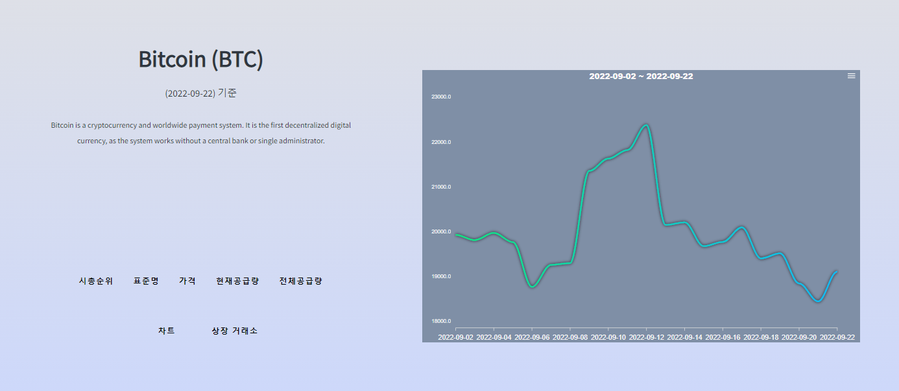

# # **가상화폐사이트 만들기**

   
  
  
   
  1. Home(Coin List화면)

   - 화면 중앙 상단에 오늘 날짜출력 (getToday()을 만들어서 활용)~~
   - 화면 우측 상단 구성요소
   - 평단가 계산
   - 화면 좌측 상단 구성요소
   - 시총순위로 코인 출력(1-20개씩) 10페이지 (React-Query와 framer-motion 이용)
   - 코인리스트 구성요소
   - 마크 , 시총순위, 이름 , 심볼
   

  
  
  
  
   

## 프로젝트 소개

JiCoin 은 가상화폐에 관심은 있지만 세부적인 내용은 모르는 입문자들을 위한 사이트입니다.  
간단한 기능으로 가상화폐의 시총순위 , 현재가격, 공급량, 한달동안의 가격변화차트, 상장된 거래소 등을 볼 수 있습니다.  
더 나아가 현재 가상화폐 혹은 주식을 하고 있는 분들을 위한 평단가 계산 기능도 추가 되어있습니다. 
또한 검색기능을 통해 시총 500위 이내의 가상화폐정보도 확인해 볼 수 있습니다. 
추가적으로 즐겨찾기, 모바일 기능, 실제 배포를 진행할 계획입니다.

 

## 기술 스택
 TypeScript |  React   |  Styled-Components   |
 :--------: | :------: | :-----: |
   ![ts]    | ![react] | ![styled] |

 ApexChart |  React-Router-Dom   |  Framer-motion   |
 :--------: | :------: | :-----: |

### 추가 기술

1. React-Query (fetch를 통한 api 사용)
2. React-modal (로그인 Modal 구현)
3. nodemon (서버 재시작을 자동으로 해줌)
4. ts-node: node에서 typescript를 compiler 하지않고, 직접 실행

 

# 구현 기능

#### 1. 가상화폐 검색기능 (공개 API 를 react-Query 를 이용해서 데이터 가져옴)
#### 2. 가상화폐 개별의 시총순위, 표준명, 가격, 공급량을 가져와서 데이터 표현
#### 3. apex chart를 이용해서 한달 가격변화를 차트로 구현
#### 4. 상장거래소 정보를 가져와서 표로 구현
#### 5. 가상화폐를 시가총액 500위 이내로 검색할 수 있도록 구현
#### 6. apollo-client 를 이용해서 밤낮 기능을 구현
#### 7. 평단가를 계산할 수 있는 calculate 구현

 

# 배운 점 

#### 1.  TypeScript 를 이용한 첫 프로젝트여서 type 설정하는데 어려움이 있다. 하지만 어려울뿐이지 자바스크립트의 타입값에 대한 한계점을 극복할 수 있다는 생각이 들었다
#### 2.  데이터를 효율적으로 가져오는 방법에 대해 많은 고민을 해보고 react query 를 사용해보았다.

# 아쉬운 점

#### 1. 사용자 로그인할 수 있도록해서 개인 화면을 구현 할 수 있도록 하는것을 추가하고 싶음
#### 2. 즐겨찾기 기능 추가하고싶음
#### 3. 유튜브나 트위터 api 를 이용해서 데이터 검색을 할 수 있도록 기능개선하고싶음
#### 4. 코드 리팩토링을 통해 파일을 분리하고싶음

 

## 라이센스

MIT &copy; [NoHack](mailto:lbjp114@gmail.com)

<!-- Stack Icon Refernces -->

[react]: ./public/img/react.png
[ts]: ./public/img/typescript.png
[styled]: ./public/img/styled.png

